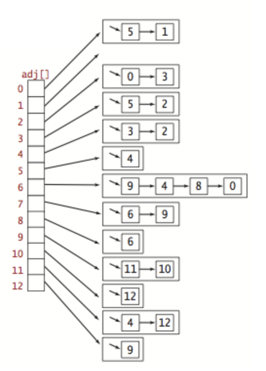

# Graphs Assignment

For this assignment you will be implementing an edgeweighted directed graph data structure and several algorithms associated with this data structure including computing the shortest path between two points in the graph.

After you have downloaded the repository make sure to unzip `test/largeEWD.txt.zip` to `test/largeEWD.txt`!!

## Input Files

This project includes multiple text files in the `test` directory which specify graphs that your program will process. The following testing files are included:

- tinyEWD.txt
- mediumEWD.txt
- largeEWD.txt

These text files contain the following format:

- line 1: number of nodes in the graph
- line 2: number of edges in the graph
- line 3 - N: each lines contains a source id, a destination id, and a weight. One line per edge.

Below is an annotated sample from tinyEWD.txt

```
8					  <-- Number of nodes
15					<-- Number of edges
4 5 0.35		<-- First edge goes from node 4 to node 5 with a weight of 0.35
5 4 0.35
4 7 0.37
5 7 0.28
...					<-- The file will continue for a total of 15 edge lines
```

Your program will parse these files and create graph structures from them. 

## Files to Edit

This assignment includes several java files that you will be responsible for editing and completing. Each file is described below, note that the files are also described in the order in which you should complete them.

### EdgeWeightedDigraph.java

This file will contain your actual graph representation. We discussed several methods of implementing a graph during the course, however your implementation should make use of an Adjacency List. Recall that an adjacency list is a compact way of representing all of the edges that comprise a graph by making use of an array of lists/bags/queues/etc.



Also recall that all nodes in the graph are represented by an integer value. This allows us to directly index into the adjacency list in order to find the list of edges that are adjacent to a given node. That list can then be iterated over in order to identify what nodes are adjacent. 

The primary purpose of this file is to ingest a file that specifies how the graph is structured and then provide users the ability to query for adjacent nodes to a given node. You are responsible for implementing all of the public methods in this file. The behavior of each method is described in the comments preceding the method. 

You can perform some basic tests of this file by building the file and executing the file directly which will execute its `main` method. 

```java
    // main method from EdgeWeightedDigraph.java
    public static void main(String[] args) {
        In in = new In(args[0]);
        EdgeWeightedDigraph G = new EdgeWeightedDigraph(in);
        StdOut.println(G);
    }
```

We can see that the main method expects a file path to be provided as a program argument. That file is then used to provide the graph information to the EdgeWeightedDigragh constructor. The constructor will read the contents of the file and build the graph from the data. You can see a snippet of the output of the program when it is provided the `tinyEWD.txt` file as the program arguments.

```
8 15
from:0 to:2 weight:0.26
from:0 to:4 weight:0.38
from:1 to:3 weight:0.29
from:2 to:7 weight:0.34
from:3 to:6 weight:0.52
```

The program prints out how many nodes and edges are contained in the graph and then proceeds to print out all of the edges contained in the graph.

### DijkstraSP.java

This file will contain your implementation of Dijksta's shortest path algorithm. This implementation will not only provide the shortest path between two points but it will also provide the actual path that generated that value. 

This file will depend on a correctly implemented `EdgeWeightedDigraph` class to function correctly. An already created graph object will be provided to the Dijkstra class as a constructor parameter. After an instance of the Dijkstra class has been created, instance methods can be used to query for shortest path information. 

You are responsible for implementing all of the public methods in this file. The behavior of each method is described in the comments preceding the method. You can perform some basic tests of this file by building the file and executing the file directly which will execute its `main` method. 

```java
  // main method from DijkstraSP.java  
	public static void main(String[] args) {
        In in = new In(args[0]);
        EdgeWeightedDigraph G = new EdgeWeightedDigraph(in);
        int s = Integer.parseInt(args[1]);

        // compute shortest paths
        DijkstraSP sp = new DijkstraSP(G, s);

        // print shortest path
        for (int t = 0; t < G.getV(); t++) {
            if (sp.hasPathTo(t)) {
                StdOut.printf("%d to %d (%.2f)  ", s, t, sp.distTo(t));
                for (DirectedEdge e : sp.pathTo(t)) {
                    StdOut.print(e + "   ");
                }
                StdOut.println();
            }
            else {
                StdOut.printf("%d to %d no path\n", s, t);
            }
        }
    }
```

Similiarly to `EdgeWeightedDigraph.java` this program expects the path to one of the input text files to be provided as an argument along with a starting vertex. We can then see a new instance of the `EdgeWeightedDigraph` class is created which is then passed to the `DijkstraSP` constructor along with the starting node ID. The constructor will then calculate the shortest paths to all other nodes in the graph from the provided starting node. All route information is then printed to the screen. A snippet of the program's output when provided tinyEWD.txt and 3 as arguments is shown below

```
3 to 0 (1.10):
	from:3 to:6 weight:0.52
	from:6 to:0 weight:0.58

3 to 1 (1.86):
	from:3 to:6 weight:0.52
	from:6 to:2 weight:0.4
	from:2 to:7 weight:0.34
	from:7 to:5 weight:0.28
	from:5 to:1 weight:0.32

3 to 2 (0.92):
	from:3 to:6 weight:0.52
	from:6 to:2 weight:0.4
```

## Grading

The test cases described above will be used as the primary grading metric for this assignment. The percentage of tests passed will determine the percentage of credit awarded for the assignment. For example, if you pass 90 percent of the tests you earn 90 percent credit for the assignment. If you pass 100 percent of the tests you will earn 100 percent credit for the assignment. Code that does not compile will not earn any points. To run all test cases across all files first highlight the `test` directory in the project explorer and use the `ctrl+shift+r` ,for macOS, or `ctrl+shift+f10`, for Windows/Linux, keyboard shortcut to begin running all tests. After the tests have completed you will be shown the number of tests that passed and failed.
